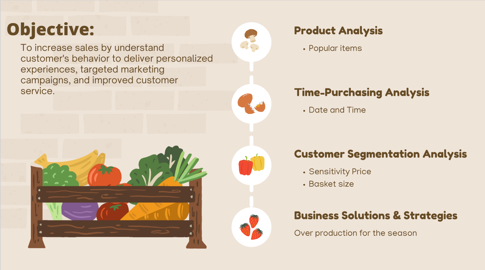
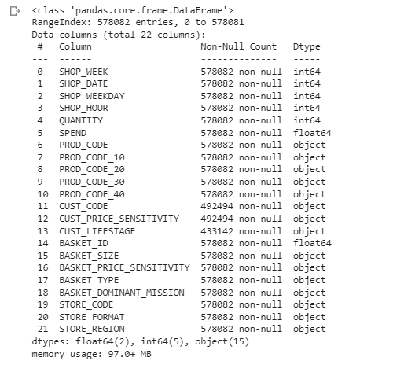
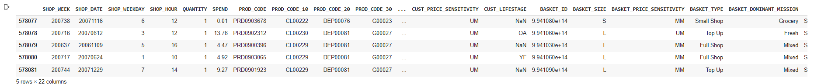
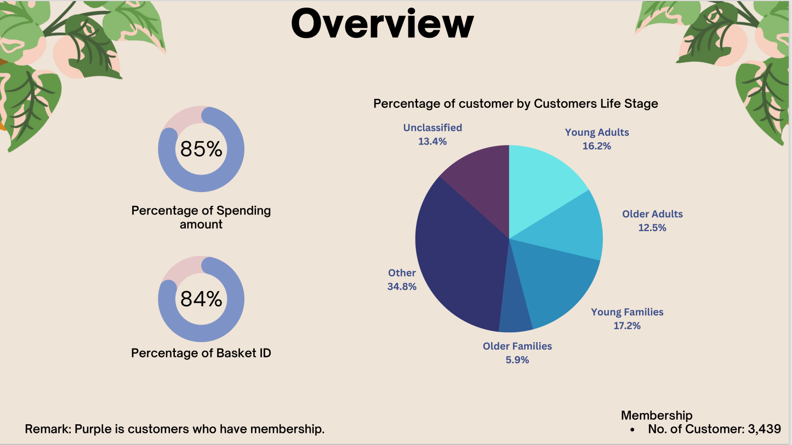
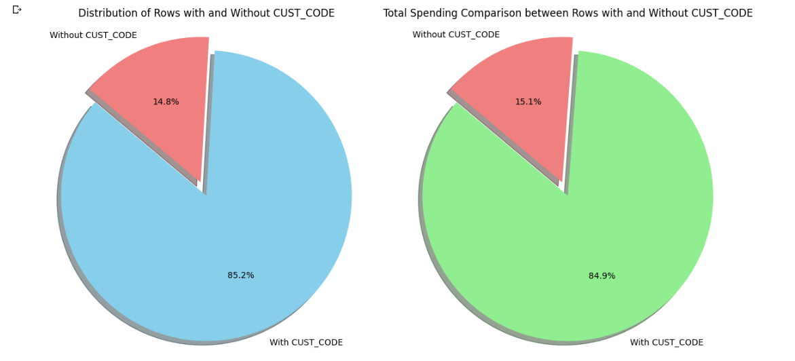
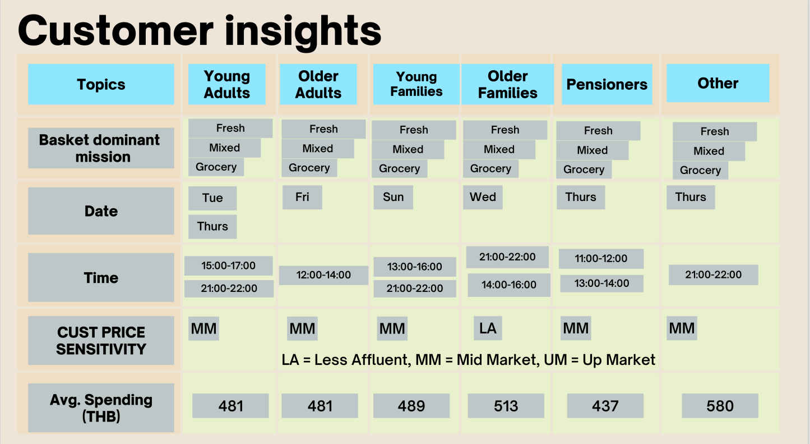
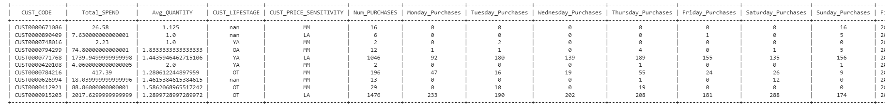

# Supermarket Customer Analytics and Customer Single View Project

## Project Objective 

The scope of the project and objective

 

## Dataset

The dataset which is used in this project consist of 21 columns as shown:

 

 

## Data Insight

After extraction, the dataset shown that the ratio of member to non-member is about 85% to 15%. The data also shown basket dominant mission, preferred date and time, customer price sensitivity and average spending of each customer's groups

 

 

 

## Customer Single View

The dataset is a transaction, the extraction to customer single view have to be made to open more insight based on the customer

 

