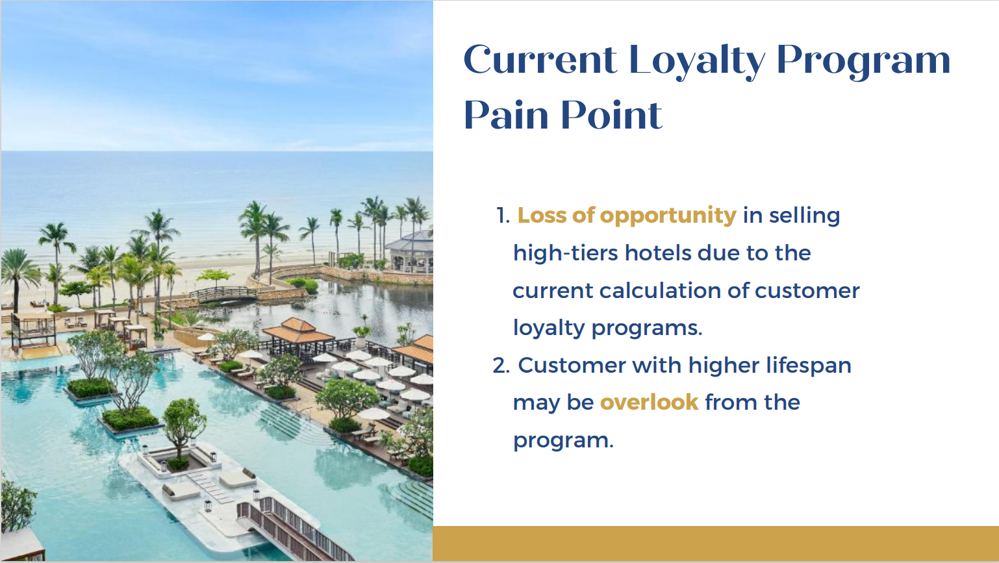

# Customer Lifetime Value

Customer Lifetime Value (CLV) is a crucial metric for Dusit Thani Group, a leading hospitality and resort company. CLV represents the total value a customer brings to the company over their entire relationship, encompassing all their interactions, stays, and spending.

## Dusit Thani Group
Dusit Thani Group is a prominent and respected hospitality conglomerate with a rich history and a strong presence in the global hospitality industry. Here's an overview of Dusit Thani Group:

## Current loyalty Program
We First look at the current loyalty program of Dusit Group. which contain 3 member tiers : Premier, Executive, Elite.

### Painpoints
Painpoints we have disccused about Dusit Thani current Customer Loyaty Program

## Adjusted Customer Loyalty Program 

### New CLV Metrics

## CLV Calculation
Adjusting a new calculation for Dusit Thani loyalty programs on the new metrics introduced. To make sure of the ability to provided the best experiences for all customer.

