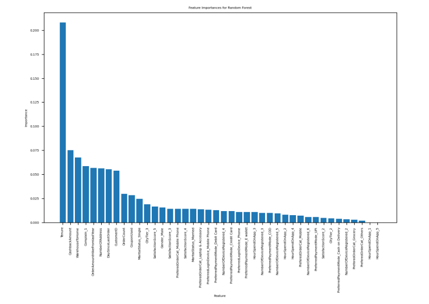

# Customer Churn Scoring

## 1) Import Dataset
The data is an ecommerce dataset including the following: 

  
  

Number of observations: 5,630   
Number of variables: 20

## 2) EDA
EDA show that there is an imbalance between number of Churn and not Churn customer. This knowledge will be furthur used during modeling phase
### Categorical columns distribution against Churn column:
  

### Numerical columns distribution:  

### Missing Value: 

Check missing value for every columns, the result is as shown below:

We filled those columns with Mode and Median.

### Corelation: 

Check correlation for numberical columns, the result shown that there is no significant level of correlation between numerical columns

Check correlation for categorical columns vs churn.

#### Feature engineering 
Prepare the features for modelling. Encoded all the categorical columns with one-hot encoding technique.

## 3) Model Creation & Evaluation
- Model Used:
- classification_models = {
    'Random Forest': RandomForestClassifier(random_state=42),
    'Logistic Regression': LogisticRegression(random_state=42),
    'Support Vector Machine': SVC(random_state=42),
    'Gradient Boosting': GradientBoostingClassifier(random_state=42),
    'XGBoost': XGBClassifier(random_state=42)
  
- Fixing Imbalance Technique: Undersampling,Oversampling, SMOTE
    'Oversampling': RandomOverSampler(sampling_strategy='minority', random_state=42),
    'Undersampling': RandomUnderSampler(sampling_strategy='majority', random_state=42),
    'SMOTE': SMOTE(sampling_strategy='auto', random_state=42)

 
  
## 4) Result Feature Importance
The best performing Model: RandomForest, Oversampling

### ROC-AUC  

### feature importance  

