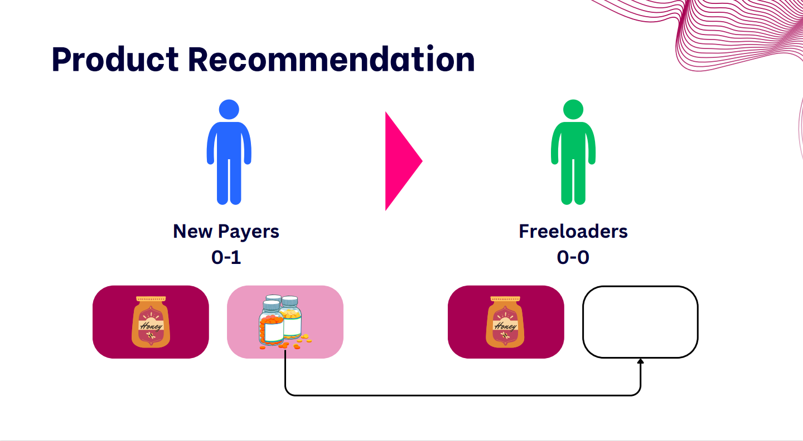
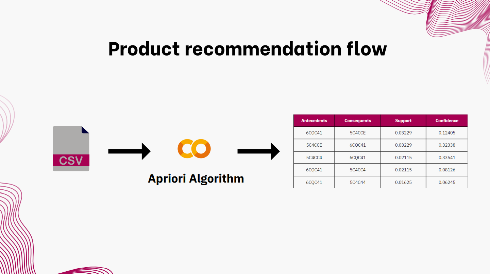
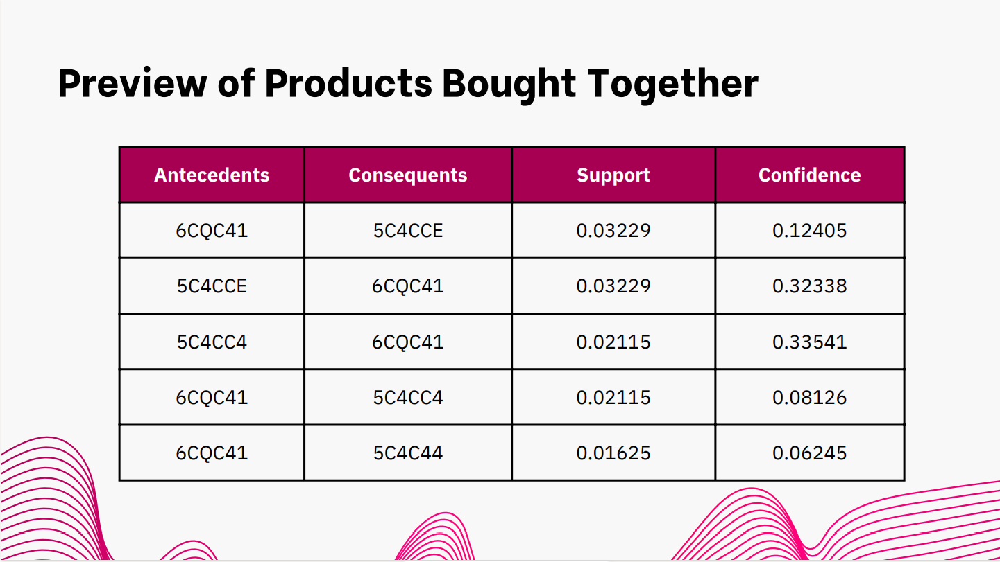

# Customer Segmentation and Product Recommendation

# Project objective

# Dataset
HDI is distribution company supported by various effective health products for dynamic modern life such as health supplements, health supplements for kids, healthy food and drink, natural personal care and skin care.
### Data understanding

### Sanity check

# Create customer single view
list of feature

# Customer segmentation

### Feature Improtant

# K-mean
Consider number of cluster by elbow and silhouette

### Clustering result

# Product recommendation
Using Apriori method to determined the combination of product sale together and used this insight to upsale these combo

