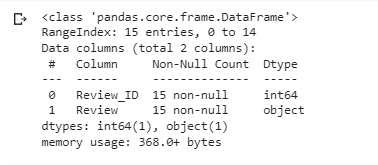
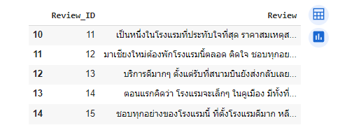
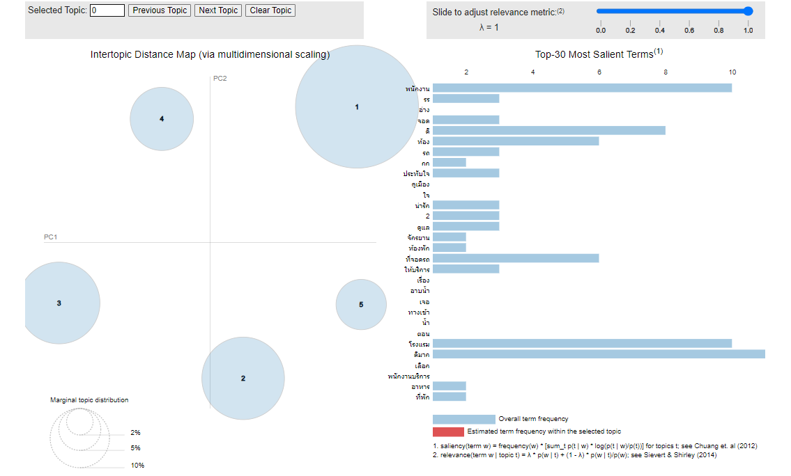
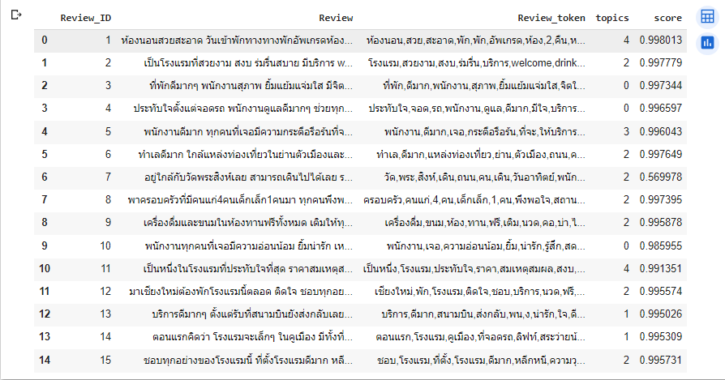

# Topic Modeling

#Project Overview

## Import Dataset

Import dataset to colab, and explore them.

  
  

## Topic Modeling
### Interopic Distance Map
  
## Top Topic
  
## Finalize dataset
  

